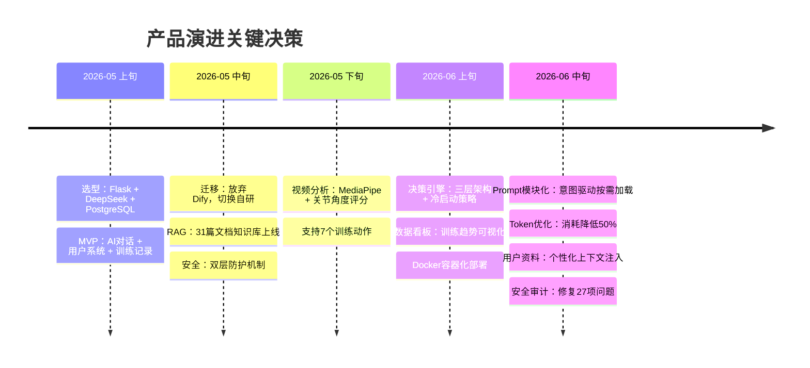

# 迭代记录

> 从 MVP 到上线，记录每次改动背后的产品思考。

---

## v1.2.0 — 产品完善版

**日期**：2026-06-20  
**类型**：功能 + 优化

### 变更

- ✨ **用户资料功能**：侧边栏新增「我的资料」按钮，支持身高/体重/训练目标/经验水平/可用器材编辑，资料自动注入 AI 对话上下文
- 🎯 **Prompt 模块化拆分**：单一 system prompt 拆分为 base.txt（角色定义）+ training.txt（训练指导）+ diet.txt（饮食建议），按用户意图动态加载
- 🎯 **Token 优化**：模块化后系统 prompt 从约 1800 tokens 降至约 900 tokens，单次对话总消耗降低约 50%
- 🎯 **意图检测**：基于关键词匹配的 `detect_intent()` 函数，自动判断用户问的是训练还是饮食问题
- 🎯 **SSE 流式超时处理**：30 秒超时自动降级，返回「服务繁忙」提示而非空白页
- 🐛 **修复**：用户档案为空时 AI 遗忘用户信息的 bug，档案表为空时跳过注入而非异常
- 📝 **文档上线**：PRD、竞品分析、技术选型、数据库设计、API 设计文档交付

### 设计决策

**为什么做模块化拆分？**
早期 prompt 把所有内容塞在一起，改一句话要动整份文件，且无论用户问什么都要加载全部上下文。模块化之后：
- 问训练问题只加载 base + training，省掉 diet 的 tokens
- 改饮食部分只改 diet.txt，不影响其他模块
- 新增模块（比如康复指导）只需加一个文件，不改现有逻辑

这本质上是**按需加载**的思路，跟前端代码分割同理——不是所有用户都需要所有能力。

---

## v1.1.0 — 智能增强版

**日期**：2026-06-10  
**类型**：功能

### 变更

- ✨ **训练决策引擎**：三层架构上线（规则引擎 36 条 + 趋势分析 + LLM 解释）
- ✨ **冷启动策略**：四阶段引导（0次→1-3次→4-7次→8+次），每个阶段给出不同粒度的建议
- ✨ **数据看板**：训练趋势图表、身体指标变化曲线（Chart.js 实现）
- ✨ **训练反馈系统**：训练后记录疲劳度、疼痛、满意度
- 📦 **Docker 容器化部署**：5 个容器（Flask Web + Motion Analysis + Decision Engine + PostgreSQL + Nginx），一键部署脚本
- 🐛 **修复**：Gunicorn 多 Worker 导致 50% 登录失效（session key 不一致）
- 🐛 **修复**：容器间通信失败（Docker 网络隔离问题）
- 🐛 **修复**：DeepSeek API 响应慢导致 Worker 排队超时被杀（增加 Worker 数 + 降低超时 + 连接池复用）

### 设计决策

**为什么用三层架构而不是全交给 LLM？**
纯 LLM 做决策的问题：不可控、成本高、冷启动无数据时胡扯。三层架构让规则引擎做确定性判断（安全/频率/基础逻辑），趋势分析做数据驱动的统计，LLM 只负责最后一层「翻译成自然语言」。这样 80% 的决策是确定性的，LLM 只做它擅长的事。

**冷启动为什么要分 4 阶段？**
0 次记录时不可能给出个性化建议，给通用建议用户又觉得没用。分阶段的好处是：用户每过一个阶段都能感受到「AI 越来越了解我」——这是留存的关键心理触发点。

---

## v1.0.0 — 第一版上线

**日期**：2026-06-01  
**类型**：功能

### 变更

- ✨ **动作视频分析系统**：MediaPipe Pose 逐帧分析 → 关节角度计算 → 5 维度评分（幅度/稳定性/对称性/节奏/控制力）→ DeepSeek 教练点评
- ✨ **RAG 知识库**：31 篇专业健身文档 → 500字/chunk 切块 → bge-m3 向量化 → 余弦相似度 Top-3 检索
- ✨ **双层安全防护**：代码层关键词预检（伤病/疼痛/扭伤等）→ 直接引导就医 + 提示词安全红线兜底
- ✨ **四层上下文注入**：系统提示词 + RAG 检索结果 + 对话历史(最近10条) + 用户档案
- ✨ **支持 11 个训练动作**：深蹲、卧推、引体向上、硬拉、杠铃划船、腿举、二头弯举等
- 🎯 **用肘角替代 depth ratio**：解决 2D 视频拍摄角度依赖问题

### 设计决策

**为什么用肘角而不是 depth ratio？**
depth ratio 依赖拍摄距离，换个角度数据就变了。肘角（上臂与前臂的夹角）是人体本身的几何属性，跟摄像头在哪无关。这是用一个简单方案解决了原本需要 3D 深度信息的问题。

**为什么用 MediaPipe 而不是 OpenPose？**
MediaPipe 轻量、不需要 GPU、有浏览器端和服务器端两种部署方式。OpenPose 精度略高但太重，对没有 GPU 的服务器不友好。选型原则：**够用就行，不堆资源**。

---

## v0.2.0 — RAG 与安全

**日期**：2026-05-20  
**类型**：功能 + 架构

### 变更

- ✨ **RAG 知识检索上线**：AI 回复不再仅靠模型自身知识，加入专业健身文档检索
- ✨ **安全预检机制**：关键词匹配拦截伤病类问题，不调用 LLM 直接引导就医
- ✨ **对话历史管理**：新建对话、切换对话、历史记录列表
- 📦 **从 Dify 迁移至 Flask 自研**：解决 Dify 的一系列限制
- 🐛 **修复**：多个 API Key 硬编码问题

### 设计决策

**为什么从 Dify 迁移到自研？**
Dify 的问题：
1. **续对话失效**——聊几轮后上下文就断了，用户必须重开对话
2. **RAG 白名单限制**——只支持选择特定知识库，无法精细控制检索逻辑
3. **黑盒调试困难**——出了 bug 不知道是 prompt 问题、RAG 问题还是 API 问题

自研后每层都能独立调试：先测 RAG 检索结果、再测 prompt 构建、最后测 API 调用。**控制力比什么都重要**。

**为什么不做向量数据库？**
31 篇文档切 500 字 chunk 大约 200-300 个向量，纯 Python 用 numpy 暴力计算余弦相似度只需要几十毫秒。引入 Milvus/Chroma 是杀鸡用牛刀，还增加一个部署依赖。

---

## v0.1.0 — MVP 核心对话

**日期**：2026-05-10  
**类型**：MVP

### 变更

- ✨ **用户系统**：注册、登录、Session 管理
- ✨ **AI 对话教练**：Flask + DeepSeek API，SSE 流式输出
- ✨ **训练记录 CRUD**：记录动作、组数、次数、重量
- 📦 **技术选型**：Flask + PostgreSQL + DeepSeek API 三件套
- 🔒 **基础安全**：密码 SHA256 加盐存储、SQL 参数化查询、Session 管理

### 设计决策

**为什么选 DeepSeek 而不是 GPT？**
中文理解好、API 价格低、兼容 OpenAI 格式（切换成本为零）。国产模型在中文健身场景下表现不输 GPT-4，但成本只有 1/10。

**为什么先做对话而不是先做视频分析？**
对话是最高频的使用场景。用户每天练完可以问一句「今天练得怎么样」，但不会每天拍视频。**MVP 要做最高频的价值点**，视频分析是差异化的低频高价值功能，放在第二阶段。

---

## 附录：关键决策时间线

---

## 版本号说明

| 版本 | 含义 |
|------|------|
| v0.1.x | MVP 阶段，核心功能可用 |
| v0.2.x | 能力增强，AI 相关功能完善 |
| v1.0.x | 第一版上线，核心模块完整 |
| v1.1.x | 智能增强，决策能力上线 |
| v1.2.x | 产品完善，体验优化 |
