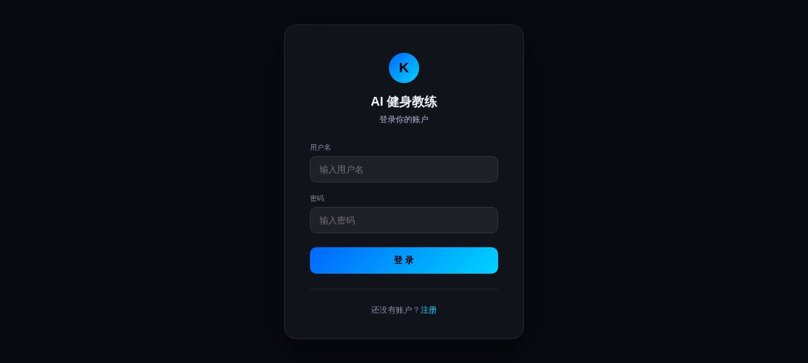
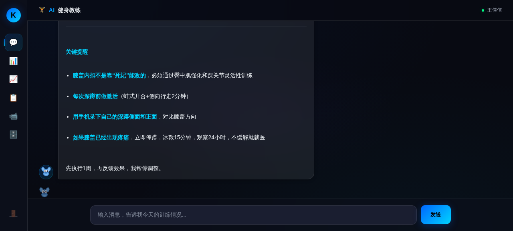
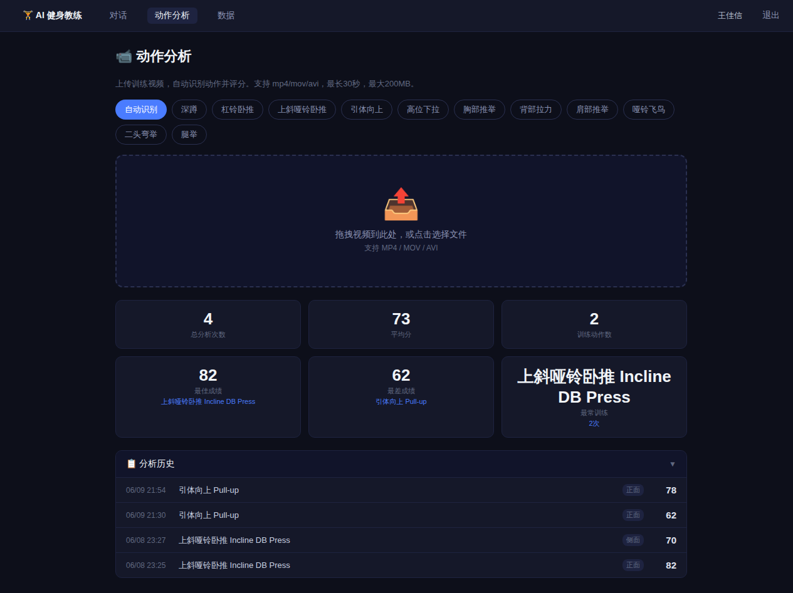
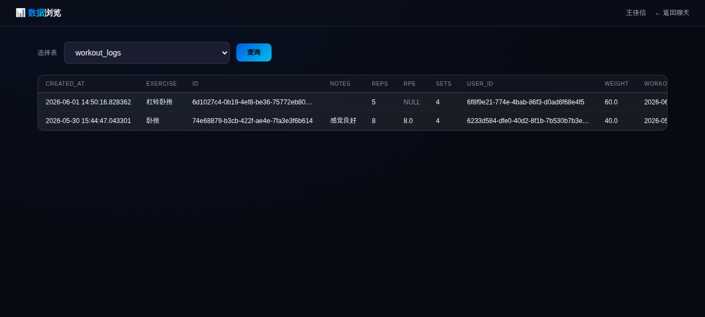

# AI 健身教练 — 产品文档

> 独立完成从 0 到 1 的 AI 健身教练产品，包含 AI 对话教练、动作视频分析、训练决策引擎三大核心模块。

**产品定位**：面向有一定健身基础但缺乏专业指导的健身爱好者，提供 AI 驱动的个性化训练指导。

**核心价值**：训练动作实时评分 + AI 对话教练 + 数据驱动的训练建议，用得越久 AI 越精准。

---

## 产品架构

```
┌─────────────────────────────────────────────────────────────────┐
│                         用户层（Web 浏览器）                       │
│              登录 → AI 对话 / 视频上传 / 训练记录 / 数据看板         │
└──────────────────────────────┬──────────────────────────────────┘
                               │ HTTP / SSE 流式
┌──────────────────────────────▼──────────────────────────────────┐
│                    Flask Web 主服务（:5000）                      │
│  ┌──────────┐ ┌──────────┐ ┌──────────┐ ┌──────────────────┐   │
│  │ 用户系统  │ │ AI 对话  │ │ 训练记录  │ │ 安全预检+RAG检索  │   │
│  └──────────┘ └────┬─────┘ └──────────┘ └────────┬─────────┘   │
└─────────────────────┼─────────────────────────────┼─────────────┘
                      │                             │
        ┌─────────────▼──────────┐    ┌─────────────▼─────────────┐
        │   DeepSeek API         │    │  SiliconFlow Embedding API │
        │   （大模型对话）         │    │  （BAAI/bge-m3 向量检索）   │
        └────────────────────────┘    └───────────────────────────┘
                      │
┌─────────────────────▼───────────────────────────────────────────┐
│              动作分析服务（MediaPipe, :9000）                      │
│   视频上传 → 姿态估计 → 关节角度计算 → 多维度评分 → 教练点评生成     │
└─────────────────────────────────────────────────────────────────┘
                      │
┌─────────────────────▼───────────────────────────────────────────┐
│                    PostgreSQL 数据库                              │
│   用户档案 / 训练记录 / 身体测量 / 训练反馈 / 决策日志 / 训练计划    │
└─────────────────────────────────────────────────────────────────┘
```

## 核心功能

### 1. AI 对话教练

基于 DeepSeek 大模型的智能健身对话，不是简单的问答机器人。

**四层上下文注入策略**：
1. **系统提示词**：角色定义 + 行为规则 + 安全红线
2. **RAG 检索**：从 31 篇健身知识文档中检索 Top-3 相关内容作为参考
3. **对话历史**：滑动窗口保留最近 10 条对话
4. **用户档案**：身高、体重、训练目标、经验水平、可用器材

**双层安全防护**：
- 代码层关键词预检：检测伤病关键词（受伤、疼痛、扭伤等），确定性拦截并引导就医
- 提示词安全红线：LLM 层面的概率性兜底

**RAG 知识库**：
- 31 篇专业健身文档（训练动作、营养方案、恢复策略、常见误区等）
- 文档切块（500 字/chunk，50 字重叠）→ BAAI/bge-m3 向量化 → 余弦相似度 Top-3 检索
- 不依赖向量数据库，纯 Python 实现，部署简单

### 2. 动作视频分析

基于 MediaPipe Pose 的实时动作评估系统。

**技术原理**：
- 视频逐帧提取 33 个人体关键点
- 计算关键关节角度（肘角、膝角、髋角等）
- 基于角度范围和变化模式评估动作质量

**评分维度**（每个动作 3-5 个维度）：
- 幅度：动作是否做到位
- 稳定性：动作轨迹是否平稳
- 对称性：左右两侧是否均衡
- 节奏：速度是否合理
- 控制力：是否有离心控制

**关键设计决策**：
- 用肘角替代 depth ratio，解决 2D 视频拍摄角度依赖问题
- 支持 11 个训练动作：深蹲、卧推、引体向上、硬拉、杠铃划船、腿举、二头弯举等
- 分析完成后调用 DeepSeek 生成专业教练点评，将评分数据转化为可执行的改进建议

### 3. 训练决策引擎

基于规则的三层决策系统，根据用户历史数据生成个性化训练建议。

**三层架构**：
1. **规则引擎**（36 条规则）：行为规则 14 条 + 安全规则 12 条 + 状态规则 10 条
2. **趋势分析**：分析训练频率、负荷变化、身体指标趋势
3. **LLM 解释**：将规则引擎的输出用自然语言生成可读建议

**冷启动策略**（分 4 阶段）：
- 0 次记录：引导用户完成首次训练
- 1-3 次：基于有限数据给出基础建议
- 4-7 次：开始分析模式和偏好
- 8+ 次：完整的个性化建议

### 4. 数据管理系统

- **用户档案**：身高、体重、年龄、训练目标、经验水平、可用器材
- **训练记录**：动作、组数、次数、重量、时间
- **身体测量**：体重、体脂率、各部位围度
- **训练反馈**：训练后主观感受（疲劳度、疼痛、满意度）
- **数据看板**：训练趋势图表、身体指标变化曲线

---

## 技术栈

| 层级 | 技术选型 | 选型理由 |
|------|---------|---------|
| 后端框架 | Python Flask | 轻量、灵活，适合快速原型 |
| 数据库 | PostgreSQL | 成熟可靠，支持 JSON 字段和复杂查询 |
| 大模型 API | DeepSeek | 国产模型，中文理解好，API 兼容 OpenAI 格式 |
| 向量检索 | SiliconFlow BAAI/bge-m3 | 高质量多语言 embedding，API 调用无需本地部署 |
| 姿态估计 | MediaPipe Pose | Google 开源，轻量级，支持浏览器端和服务器端 |
| 容器化 | Docker + docker-compose | 5 个服务一键部署，环境隔离 |
| 反向代理 | Nginx | 统一入口，静态资源缓存 |

---

## 部署架构

```
                    ┌─────────┐
                    │  Nginx  │ :80/:443
                    └────┬────┘
                         │
        ┌────────────────┼────────────────┐
        │                │                │
   ┌────▼────┐    ┌──────▼──────┐   ┌────▼────┐
   │ Flask   │    │ Motion      │   │ 决策引擎 │
   │ Web     │    │ Analysis    │   │ :8001   │
   │ :5000   │    │ :9000       │   └─────────┘
   └────┬────┘    └─────────────┘
        │
   ┌────▼──────┐
   │ PostgreSQL│
   │ :5432     │
   └───────────┘
```

**5 个 Docker 容器**：Flask Web、Motion Analysis、Decision Engine、PostgreSQL、Nginx

**一键部署**：`bash push-all.sh` — 本地测试 → 代码同步 → 远程重建容器 → 健康检查

---

## 产品设计决策

| 决策点 | 选择 | 理由 |
|--------|------|------|
| AI 对话方案 | 从 Dify 切换为直调 DeepSeek API | Dify 平台 bug（续对话失效）、RAG 白名单限制、黑盒调试困难。产品逻辑复杂后，控制力 > 入门速度 |
| RAG 实现 | 自建 Python 实现，不引入向量数据库 | 31 篇文档规模不需要 Milvus 等重方案，纯 Python + API 调用足够，部署简单 |
| 安全策略 | 代码层预检 + 提示词红线双层 | 确定性拦截（代码）+ 概率性兜底（LLM），不依赖单一防线 |
| 动作评分 | MediaPipe + 关键点角度计算 | 轻量级，不需要 GPU，2D 视频即可，通过肘角设计解决拍摄角度依赖 |
| 部署方案 | Docker 容器化 | 环境隔离、一键部署、易于迁移 |

---

## 运行问题与解决方案

| 问题 | 根因 | 解决方案 |
|------|------|---------|
| 50% 登录失效 | Gunicorn 4 Worker 各生成不同 session key | 固定 FLASK_SECRET_KEY |
| 容器间通信失败 | 不同 Docker 网络的容器互不相通 | docker network connect 接入同一网络 |
| Worker 被杀 | DeepSeek API 响应慢导致排队超时 | 增加 Worker 数 + 降低超时 + 连接池复用 |
| 服务不自动恢复 | 容器重启策略遗漏 | 统一设置 unless-stopped |
| API Key 泄露 | 硬编码在源码中 | 安全审计发现并修复，改用环境变量 |

---

## 安全审计

完成全面代码安全审计，发现并修复 **27 项安全/质量问题**：
- API Key 硬编码 → 环境变量
- XSS 漏洞 → 输入过滤和转义
- 路径遍历 → 路径校验
- SQL 注入 → 参数化查询
- Session 安全 → 固定密钥 + HttpOnly + Secure

---

## 文件结构

```
fitness-web/
├── app.py                 # Flask 主服务（826 行）
├── rag.py                 # RAG 向量检索模块
├── Dockerfile             # Web 服务容器配置
├── .env                   # 环境变量配置
├── knowledge/             # RAG 知识库（31 篇文档）
│   ├── 动作详细/           # 各动作技术指南
│   ├── 动作/               # 动作要点速查
│   └── *.md               # 训练/营养/恢复知识
├── templates/             # HTML 模板
│   ├── login.html
│   ├── chat.html          # AI 对话界面
│   └── analysis.html      # 动作分析界面
└── 问题记录.md             # 开发过程中的问题与解决方案
```

---

## 演示

### 登录页面


### AI 对话教练


### 动作视频分析


### 训练数据看板


---

## 相关文档

- [产品需求文档（PRD）](PRD.md)
- [竞品分析](竞品分析.md)
- [技术选型决策](技术选型决策.md)
- [数据库设计](数据库设计.md)
- [API 设计](API设计.md)
