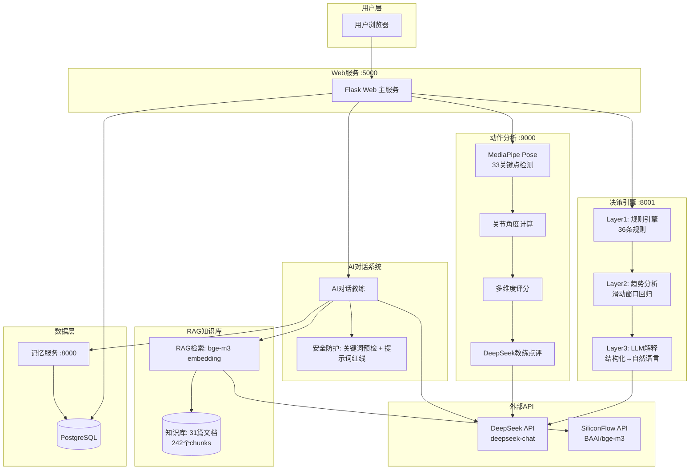
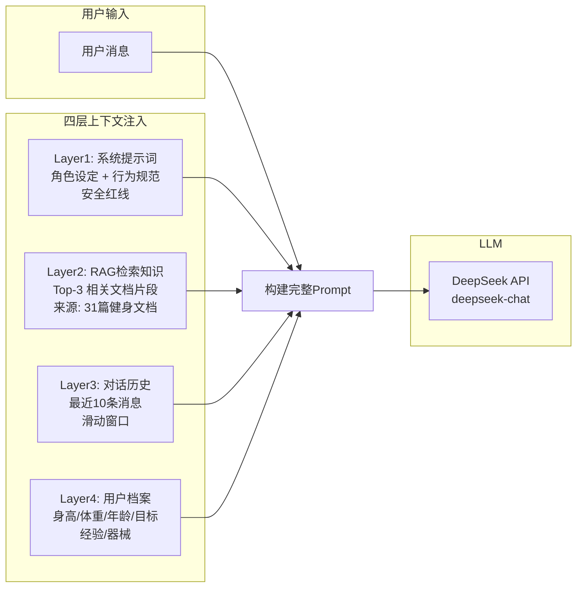
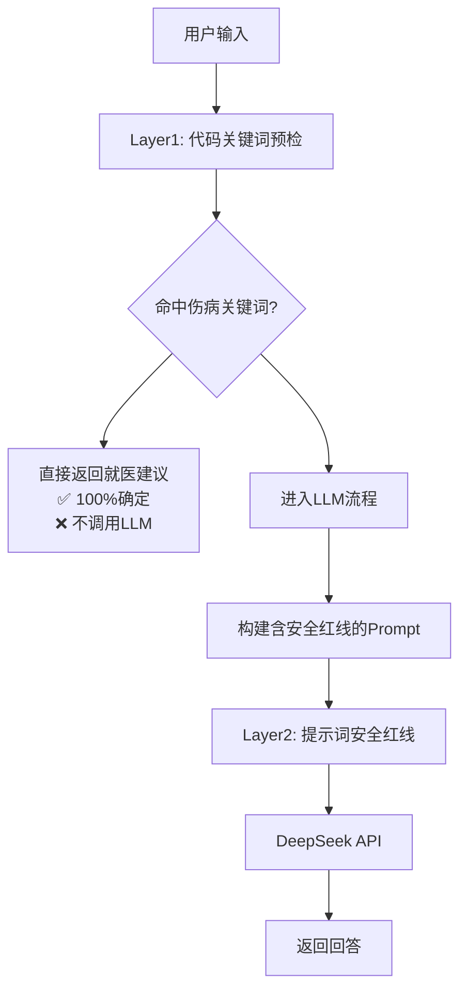
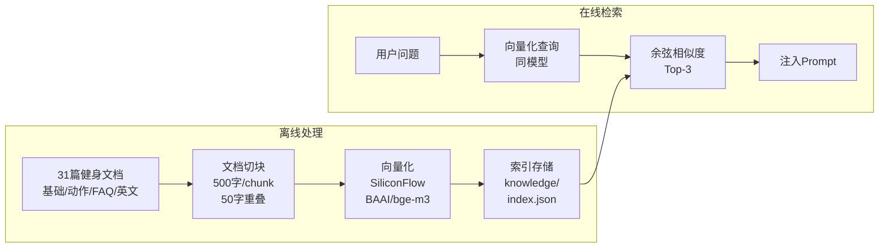

# AI能力架构

> 本文档系统描述 AI 健身教练产品的四大 AI 核心能力：AI 对话教练、RAG 知识库、动作视频分析、训练决策引擎。每个模块都包含完整的技术设计、Pipeline 流程以及"为什么这么选"的产品决策说明。

---

## 1. 整体 AI 架构总览

AI 健身教练的 AI 能力由四个独立模块组成，分别处理**对话理解**、**知识检索**、**视觉感知**和**决策推理**。模块之间松耦合，通过 Flask Web 主服务统一调度。



**模块职责边界：**

| 模块 | 独立部署 | 端口 | 核心依赖 | 主要职责 |
|------|---------|------|---------|---------|
| fitness-web | ✅ Docker | 5000 | Flask | 用户交互、对话调度、RAG检索触发 |
| memory-service | ✅ Docker | 8000 | FastAPI | 用户档案、训练记录、对话记忆存储 |
| motion-analysis | ✅ Docker | 9000 | FastAPI + MediaPipe | 视频上传、姿态分析、评分计算 |
| decision-engine | ✅ Docker | 8001 | FastAPI | 规则评估、趋势分析、决策生成 |
| PostgreSQL | ✅ Docker | 5432 | - | 所有持久化数据 |

---

## 2. AI 对话系统

### 2.1 概述

AI 对话教练是产品的核心交互入口，本质是一个**增强型 RAG 对话系统**——不是简单的"用户问→LLM 答"，而是在调用大模型之前，先将用户的上下文信息注入到 Prompt 中，让 LLM 的回答有据可依、因人而异。

### 2.2 四层上下文注入策略

每次用户发起对话，系统构建 Prompt 时从四个维度注入上下文：



**各层的作用与设计说明：**

| 层级 | 内容 | 目的 | 为什么必须有 |
|------|------|------|-------------|
| **Layer1 系统提示词** | 角色设定（AI健身教练）、回答规范（简洁/专业/安全）、知识边界声明 | 定义AI的行为边界和回答风格 | LLM是通用模型，不给角色设定就是"AI废话"，用户得不到专业感 |
| **Layer2 RAG知识** | 从31篇知识库中检索与用户问题最相关的3个文档片段 | 让回答基于专业知识而非LLM的"常识" | 纯LLM可能胡说，RAG保证了回答有来源、有依据 |
| **Layer3 对话历史** | 当前对话中最近的10条消息（滑动窗口） | 维持多轮对话的连贯性 | 没有历史上下文，AI就会"失忆"，用户每次都得重复说 |
| **Layer4 用户档案** | 身高、体重、年龄、训练目标、经验水平、可用器械 | 让回答个性化、贴合用户实际情况 | 没有档案，AI就是"通用的"，不知道你该增肌还是减脂 |

**为什么是这四层？** 这四层分别解决了四个问题：**AI是谁**（Layer1）、**AI知道什么**（Layer2）、**刚才说了什么**（Layer3）、**你在跟谁说话**（Layer4）。缺任何一层，体验都会明显打折。

### 2.3 双层安全防护

伤病问题是健身场景的高风险场景——用户说"膝盖疼"如果AI回一句"继续练"，可能导致真实伤害。为此设计了双层防护：



| 防护层 | 方式 | 确定性 | 作用 |
|--------|------|--------|------|
| **Layer1: 代码关键词预检** | 匹配预定义的伤病关键词列表（"膝盖疼""肩膀痛""腰伤"等） | ✅ 100%确定 | 兜底机制，不让任何伤病类问题漏到LLM |
| **Layer2: 提示词安全红线** | System Prompt 中定义安全规则（"如果用户提到身体不适，必须建议就医"） | ⚠️ 概率性（LLM 可能忽略） | 覆盖 Layer1 未穷举的、模糊表达的伤病描述 |

**为什么不用纯提示词防护？** 纯提示词的防护是"概率性的"——大模型有时候会忽略安全指令。而代码层关键词匹配是"确定性的"，命中就一定拦截。伤病问题的代价太高，所以用确定性兜底。

**为什么不用纯代码拦截？** 用户表达伤病的方式太多了（"胳膊抬不起来""练完肩膀不爽""腰有点紧"），不可能穷举。所以代码层负责"明确表达"的部分，提示词负责"模糊表达"的部分，两层互补。

**关键词列表维护策略：** 关键词库会持续扩展，每次发现新的伤病表达方式就补充进去，同时通过对话日志分析漏报情况。

### 2.4 对话处理 Pipeline

完整的一次对话处理流程：

```
用户输入消息
    │
    ▼
┌──────────────────────────────────────────┐
│ Step 1: 伤病关键词预检                     │
│  - 匹配预定义伤病关键词列表                  │
│  - 命中 → 直接返回就医建议（不调LLM）        │
│  - 未命中 → 继续                            │
└──────────────────────────────────────────┘
    │
    ▼
┌──────────────────────────────────────────┐
│ Step 2: 加载用户档案                       │
│  - 从 memory-service 获取用户信息           │
│  - 包括身高/体重/目标/经验/器械             │
│  - 无档案用户 → 跳过（新用户）              │
└──────────────────────────────────────────┘
    │
    ▼
┌──────────────────────────────────────────┐
│ Step 3: RAG知识库检索                      │
│  - 用户问题 → bge-m3 embedding 向量化      │
│  - 余弦相似度检索 Top-3                    │
│  - 无相关结果 → 跳过（AI基于通用知识回答）   │
└──────────────────────────────────────────┘
    │
    ▼
┌──────────────────────────────────────────┐
│ Step 4: 加载对话历史                       │
│  - 读取当前对话最近 10 条消息               │
│  - 跨对话记忆（最近 200 条）待规划           │
│  - 无历史 → 跳过（新对话首条消息）           │
└──────────────────────────────────────────┘
    │
    ▼
┌──────────────────────────────────────────┐
│ Step 5: 构建 Prompt                       │
│  System: [角色设定 + 安全红线 + 行为规范]   │
│  Knowledge: [RAG检索结果 Top-3]            │
│  History: [最近 10 条对话]                  │
│  Profile: [用户档案信息]                    │
│  User: [当前用户消息]                       │
└──────────────────────────────────────────┘
    │
    ▼
┌──────────────────────────────────────────┐
│ Step 6: 调用 DeepSeek API                 │
│  - stream=true (SSE 流式输出)              │
│  - 超时 30 秒                              │
│  - 重试策略: 首次失败等 1s 重试             │
└──────────────────────────────────────────┘
    │
    ▼
┌──────────────────────────────────────────┐
│ Step 7: 流式返回前端 + 持久化              │
│  - SSE 实时推送, 前端打字效果               │
│  - 完整回复存入 PostgreSQL messages 表     │
│  - 更新 conversation 的最后时间戳           │
└──────────────────────────────────────────┘
```

**为什么不用 WebSocket 用 SSE？** SSE 是单向的，天然适配"用户提问→服务器推送"的模式，实现简单、兼容性好。DeepSeek API 本身也是 SSE 格式，后端做透传即可，无需维护 WebSocket 连接状态。

**为什么对话历史窗口是 10 条？** 10 条是经过测试的平衡点：太少（≤5 条）会导致 AI 记不住前面说过什么；太多（≥20 条）会增加 Token 消耗且超出 DeepSeek 上下文窗口时会被截断。10 条覆盖了正常的健身咨询对话轮次（用户问 3-5 轮，AI 答 3-5 轮）。

---

## 3. RAG 知识库

### 3.1 概述

RAG（Retrieval-Augmented Generation）是 AI 对话教练回答质量的保障。31 篇专业健身文档经过切块、向量化后，在用户提问时检索最相关的知识片段注入 Prompt。核心设计原则：**在不需要向量数据库的规模下，实现专业级的检索质量**。

### 3.2 文档处理 Pipeline



**离线处理流程：**

```
文档收集阶段
┌──────────────────────────────────────────────────┐
│ 31 篇文档来源:                                     │
│  - 基础知识类 (14篇): 增肌减脂/训练计划/补剂/误区    │
│  - 动作详解类 (8篇): 深蹲/卧推/硬拉等技术指南        │
│  - 动作速查类 (5篇): 快速查阅动作要点               │
│  - 英文参考类 (3篇): 动作库/营养/恢复               │
│  - FAQ类 (1篇): 常见问题汇总                       │
└──────────────────────────────────────────────────┘
    │
    ▼ 读取文档内容（支持 .md / .txt 格式）

文档切块
┌──────────────────────────────────────────────────┐
│ 参数:                                             │
│  - chunk_size = 500 字符                          │
│  - overlap = 50 字符                              │
│                                                   │
│ 策略说明:                                         │
│  - 500字符 ≈ 300-400字中文段落, 一个完整知识点     │
│  - 50字重叠 ≈ 1-2句话, 保证切分处不丢失上下文      │
│                                                   │
│ 结果: ~242 个 chunks                              │
└──────────────────────────────────────────────────┘
    │
    ▼ 调用 SiliconFlow Embedding API

向量化
┌──────────────────────────────────────────────────┐
│ 模型: BAAI/bge-m3                                 │
│ 维度: 1024                                        │
│ 为什么选 bge-m3:                                  │
│  - 中文 embedding 能力领先 (MTEB中文榜 Top 级)     │
│  - 支持多语言（英文文档也可处理）                    │
│  - 性价比高, SiliconFlow 价格低                    │
│  - bge-m3 比 bge-large-zh 更好, 支持多粒度检索     │
└──────────────────────────────────────────────────┘
    │
    ▼ 存储为 JSON 索引

索引存储
┌──────────────────────────────────────────────────┐
│ 格式: knowledge/index.json                        │
│ 结构:                                            │
│  [                                                │
│    {                                              │
│      "id": 0,                                     │
│      "text": "深蹲时注意膝盖不要内扣...",           │
│      "embedding": [0.123, -0.456, ...],           │
│      "source": "深蹲技术指南.md",                  │
│      "chunk_index": 2                             │
│    },                                             │
│    ... 共 ~242 条                                   │
│  ]                                                │
│                                                   │
│ 内存加载: 启动时加载全部向量到内存                   │
│ 约 242 × 1024 × 4 bytes ≈ 1MB                     │
└──────────────────────────────────────────────────┘
```

**在线检索流程：**

```
用户问题 "深蹲膝盖疼怎么办"
    │
    ▼
┌──────────────────────────────────────────────┐
│ 查询向量化                                     │
│  调用同一 SiliconFlow bge-m3 API               │
│  将用户问题转为 1024 维向量                     │
│  耗时: ~100ms                                  │
└──────────────────────────────────────────────┘
    │
    ▼
┌──────────────────────────────────────────────┐
│ 余弦相似度检索                                  │
│  遍历 ~242 个 chunks, 计算余弦相似度            │
│  cosine_sim(A, B) = A·B / (|A| × |B|)         │
│  取 similarity 最高的 3 个 chunks               │
│  耗时: ~5ms （纯 Python 循环即可）              │
└──────────────────────────────────────────────┘
    │
    ▼
┌──────────────────────────────────────────────┐
│ 注入 Prompt                                    │
│  将 Top-3 chunks 的 text 拼接后注入 System     │
│  格式:                                         │
│  "以下是与用户问题相关的专业资料:                 │
│   [来源: 深蹲技术指南.md]                       │
│   深蹲时膝盖应向外推...                          │
│   [来源: 健身FAQ.md]                            │
│   膝盖疼痛可能是因为...                          │
│   "                                             │
└──────────────────────────────────────────────┘
```

### 3.3 关键设计决策

**为什么 chunk_size 选 500 字而不是更多或更少？**

- 健身文档的知识点通常在一个段落内完成（如"深蹲的正确姿势"约 300-500 字）
- chunk 太小（<200 字）：知识不完整，用户问题可能只匹配到半句话
- chunk 太大（>1000 字）：一个 chunk 包含多个知识点，Top-3 的冗余高，Token 浪费
- 500 字是经过不同参数测试后发现检索相关性最高的选择

**为什么 overlap 是 50 字？**

- 50 字 ≈ 1-2 句中文，刚好覆盖段落衔接处的上下文
- 如果两个 chunks 的切分点刚好在关键信息中间，overlap 能确保至少一个 chunk 包含完整信息
- 更大的 overlap（如 100 字）会引入过多重复内容，降低检索效率

**为什么用 Cosine Similarity 而不是向量数据库？**

| 方案 | 适用场景 | 本产品的考量 |
|------|---------|-------------|
| Milvus/Pinecone 等向量数据库 | 百万级以上向量、需要实时更新、需要分片 | 31 篇文档 ≈ 242 个 chunks，连"小规模"都算不上 |
| 本地 Python 余弦相似度 | 万级以下、单机部署 | 242 个 1024 维向量 ≈ 1MB，遍历一次 < 5ms，零部署成本 |

**核心结论：不是向量数据库不好，是大炮打蚊子。** 242 个 chunks 的规模下，引入 Milvus 需要额外启动一个容器（至少 2GB 内存），增加了部署复杂度和资源消耗，而纯 Python 实现就能在 5ms 内完成检索。等知识库扩展到 10 万级文档时再考虑向量数据库。

**为什么用 SiliconFlow 而不是本地跑 embedding 模型？**

- 本地跑 bge-m3 需要 GPU 或大量 CPU 资源（即使量化也需要数 GB 内存）
- SiliconFlow API 每次调用仅需 ~100ms，成本极低
- 31 篇文档是离线处理，调用次数有限；线上检索也只对用户问题做一次 embedding
- 产品早期阶段，外部 API 是最优选择，后期如果查询量大可考虑本地部署

---

## 4. 动作分析 Pipeline

### 4.1 概述

动作视频分析是产品的差异化核心能力——用户上传训练视频，AI 逐帧分析动作质量并给出评分和建议。整个 Pipeline 在服务端完成，用户只需要一部手机拍一段侧面或正面视频。**不依赖 3D 深度信息，普通手机拍摄即可。**

### 4.2 完整 Pipeline

```mermaid
graph TB
    subgraph 输入
        V[用户上传视频<br/>mp4/mov/avi/webm]
        ACT[选择动作类型<br/>深蹲/卧推/硬拉...]
    end

    subgraph Step1: 姿态检测
        FP[逐帧处理<br/>~30fps]
        MP[MediaPipe Pose<br/>Landmarker]
        KP[33个人体关键点<br/>每帧坐标 (x, y)]
    end

    subgraph Step2: 角度计算
        JC[关节角度计算<br/>肘角/膝角/髋角/肩角]
        TS[角度时间序列<br/>每帧的关节角度数组]
    end

    subgraph Step3: 多维评分
        AMP[幅度评分<br/>动作范围是否充足]
        STAB[稳定性评分<br/>身体晃动程度]
        SYM[对称性评分<br/>左右是否平衡]
        RHY[节奏评分<br/>离心/向心比例]
        CTL[控制力评分<br/>是否借力/惯性]
    end

    subgraph Step4: 点评生成
        DG[DeepSeek API<br/>教练点评生成]
        COM[自然语言点评<br/>问题描述+改进建议]
    end

    subgraph 输出
        SC[综合评分 0-100<br/>+ 分项评分]
        CHART[角度曲线图<br/>关节角度变化]
        COMMENT[AI教练中文解读<br/>包含具体数据]
    end

    V --> FP
    ACT --> FP
    FP --> MP
    MP --> KP
    KP --> JC
    JC --> TS

    TS --> AMP
    TS --> STAB
    TS --> SYM
    TS --> RHY
    TS --> CTL

    AMP --> SC
    STAB --> SC
    SYM --> SC
    RHY --> SC
    CTL --> SC

    SC --> DG
    TS --> DG
    AMP --> DG
    STAB --> DG
    SYM --> DG
    RHY --> DG
    CTL --> DG

    DG --> COM
    SC --> CHART

    SC --> OUTPUT[返回前端]
    CHART --> OUTPUT
    COM --> OUTPUT
```

### 4.3 各步骤详细设计

#### Step 1: MediaPipe Pose 姿态估计

MediaPipe Pose 是 Google MediaPipe 套件中的人体姿态估计模型，在 CPU 上即可实时运行。

| 参数 | 值 | 说明 |
|------|-----|------|
| 模型 | pose_landmarker_lite | 轻量级，CPU 可跑 |
| 关键点 | 33 个 | 全身关键点（头部2+躯干8+双臂6+双腿17） |
| 精度 | 全帧率检测 | 每秒约 30 帧分析 |
| 无加速 | CPU only | 不需要 GPU |

**33 个关键点分布：**

```
    0: 鼻子
    11,12: 左右肩          ┌── 肩部 ──┐
    13,14: 左右肘          │   ┌──┐   │
    15,16: 左右腕          │   │  │   │
    23,24: 左右髋          └── 躯干 ──┘
    25,26: 左右膝          │   ┌──┐   │
    27,28: 左右踝          │   │  │   │
                          └── 腿部 ──┘
    其他: 眼睛/耳朵/足尖/足跟
```

**为什么用 MediaPipe 而不是 OpenPose / MMPose？**

| 方案 | 精度 | 速度 | 部署复杂度 | 本产品的考量 |
|------|------|------|-----------|-------------|
| **MediaPipe Pose** | 中上 | 极快（CPU可实时） | 低（pip install） | **选择** — 够用、快、易部署 |
| OpenPose | 高 | 慢（需GPU） | 高（C++编译） | 部署成本太高，大材小用 |
| MMPose | 高 | 中等 | 高（PyTorch+GPU） | 精度溢出的同时增加了资源开销 |
| 纯深度学习自研 | - | - | 极高 | 超出产品阶段需求 |

**核心结论：MediaPipe 提供的 33 个关键点对于健身动作分析来说已经足够。** 健身动作分析的核心不是"关键点定位多精确"，而是"角度计算逻辑多合理"。精度方面 MediaPipe 的误差在 2-5° 以内，对于健身指导场景（接受 5-10° 的误差范围）完全够用。更精准的模型（如 OpenPose）带来的精度提升不足以弥补部署复杂度的大幅增加。

#### Step 2: 关节角度计算

从 33 个关键点坐标计算关键关节角度，这是"将坐标数据转化为动作语义"的关键步骤。

**核心角度计算逻辑：**

```python
def calculate_angle(a, b, c):
    """三点法计算关节角度
    a, b, c 是三个关键点坐标 (x, y)
    b 是关节中心点
    返回角度值（度）
    """
    ba = (a.x - b.x, a.y - b.y)
    bc = (c.x - b.x, c.y - b.y)
    dot_product = ba[0]*bc[0] + ba[1]*bc[1]
    magnitude = math.sqrt(ba[0]**2 + ba[1]**2) * math.sqrt(bc[0]**2 + bc[1]**2)
    return math.degrees(math.acos(dot_product / magnitude))
```

**各动作计算的关节角度：**

| 动作 | 主要角度 | 辅助判断 |
|------|---------|---------|
| 深蹲 | 膝角（髋-膝-踝）、髋角（肩-髋-膝） | 躯干前倾角度 |
| 卧推 | 肘角（肩-肘-腕）、肩角 | 杠铃轨迹（腕部垂直位移） |
| 硬拉 | 髋角（肩-髋-膝）、膝角、背部曲度 | 杠铃相对位置 |
| 引体向上 | 肘角、肩角 | 身体摆动幅度 |
| 杠铃划船 | 躯干角度（水平夹角）、肘角 | 杠铃轨迹 |
| 二头弯举 | 肘角（肩-肘-腕） | 肩部稳定性 |
| 腿举 | 膝角、髋角 | 腿部对称性 |

**为什么用肘角替代 depth ratio？** 这是本产品动作分析的一个关键设计创新。

传统视频分析中，有些方案使用 depth ratio（深度比）来估算关节深度位置，这需要 3D 信息或多视角相机。但本产品只用 2D 视频，所以需要一种**不依赖深度信息就能准确评估动作质量**的方法。

用肘角替代 depth ratio 的工作原理：
- 在卧推中，传统方法用"杠铃下降深度"来判断幅度是否充分
- 但在 2D 视频中，深度信息是缺失的，无法准确测量杠铃的垂直下降距离
- 用肘角替代：卧推到底部时肘角应该 < 90°，推起时接近 180°
- 肘角的计算只依赖 2D 坐标，与拍摄角度无关
- 同理，深蹲用膝角和髋角替代"臀部下降高度"的判断

**这个设计让 2D 视频分析达到了可用水平。** 用户不需要专业的拍摄设备，手机随手拍一个侧面视频就能得到分析结果。

#### Step 3: 多维度评分

评分采用多维度的独立评分后加权综合的方式。每个维度都有独立的算法逻辑，互不干扰。

| 维度 | 权重 | 算法逻辑 | 评分依据（0-10） |
|------|------|---------|-----------------|
| **幅度 (Amplitude)** | 30% | 关节角度最大最小值范围与标准范围对比 | 动作范围越接近标准，得分越高 |
| **稳定性 (Stability)** | 25% | 躯干关键点的水平和垂直位移标准差 | 晃动越小，得分越高 |
| **对称性 (Symmetry)** | 15% | 左右侧关键点的角度偏差 | 左右越对称，得分越高 |
| **节奏 (Rhythm)** | 15% | 离心/向心阶段的时间比例 | 离向心比越接近 2:1，得分越高 |
| **控制力 (Control)** | 15% | 动作末端是否出现急停/反弹/惯性 | 越平滑可控，得分越高 |

**综合评分 = 0-100分 = (幅度×30% + 稳定性×25% + 对称性×15% + 节奏×15% + 控制力×15%) × 10**

**为什么用多维度评分而不是单一评分？** 单一评分（如"深蹲 78 分"）对用户的指导价值有限——用户只知道"不高不低"，不知道哪里该改进。多维评分让用户一眼看出"幅度做得不错（9分），但稳定性太差（5分），下次注意稳住躯干"。

**为什么维度权重这样分配？** 幅度（30%）和稳定性（25%）权重最高，因为这两项是健身动作的基础——动作做够了范围才有效，不够稳定容易受伤。对称性和节奏权重稍低，属于"进阶优化"维度。这个权重分配参考了专业健身教练的评估习惯。

#### Step 4: DeepSeek 教练点评生成

评分数据虽然是结构化的，但对普通用户来说"只看分数是不够的"。最后一步用 DeepSeek 将结构化数据转换为自然语言的教练点评。

**输入的 Prompt 结构：**

```
你是一个专业健身教练，请根据以下动作分析数据为用户生成点评。

动作：深蹲
综合评分：78/100
分项评分：
- 幅度：8/10（动作范围充分）
- 稳定性：5/10（躯干有明显晃动）
- 对称性：7/10（略有左右不平衡）
- 节奏：6/10（下降过快）
- 控制力：7/10（底部有反弹）

关键角度数据：
- 膝盖角度变化: 45° → 120° → 48°
- 髋关节角度变化: 80° → 150° → 82°
- 躯干前倾角度: 平均 35°

要求：
1. 先肯定做得好的地方（1-2句）
2. 指出最需要改进的1-2个问题（具体到数据）
3. 给出可操作的改进建议（1个重点建议即可）
4. 语言简练，不需要重复评价所有维度
```

**为什么不用规则模板而用 LLM？**

| 方案 | 优点 | 缺点 |
|------|------|------|
| 规则模板（if-else） | 稳定、可控 | 僵硬、千篇一律、无法适应不同分数组合 |
| LLM 生成 | 灵活、自然、可适应任意分数组合 | 偶尔生成不规范内容（可通过 Prompt 约束） |

**核心结论：LLM 生成的点评比模板更自然。** 规则模板生成的点评永远是"你的幅度还可以，但稳定性需要改进"，用户看三次就腻了。LLM 可以基于具体分数生成有差异化的点评，比如"你这次深蹲的幅度做得不错，但重心明显偏左——注意膝盖要向外推"。虽然偶有生成不规范的风险，但通过精心设计的 Prompt 和限定输出格式，风险可控。

### 4.4 性能指标

| 指标 | 当前值 | 目标值 | 优化方向 |
|------|--------|--------|---------|
| 视频上传→结果返回 | < 30 秒 | < 20 秒 | 减少帧采样率（从全帧改为 1/2 帧） |
| 单人视频分析 | < 15 秒 | < 10 秒 | 加入帧数限制（最长 60 秒视频） |
| 评分准确率 | > 80% | > 85% | 持续收集标注数据优化算法 |
| 支持动作 | 7 种 | 12 种 | 按优先级逐步添加 |

**为什么是 30 秒？** 用户上传的视频通常在 15-30 秒（一组动作 8-12 次，每次约 2-3 秒），加上服务端逐帧分析和 API 调用，30 秒内返回是用户可接受的等待时间上限。超过 30 秒用户可能以为系统挂了。

---

## 5. 训练决策引擎

### 5.1 概述

训练决策引擎是产品的"大脑"——它不是简单的 if-else 逻辑，而是三层架构的智能决策系统，基于用户的历史训练数据自动判断"今天的训练是否需要调整"。**核心价值：让 AI 不仅能回答问题，还能主动给出训练建议。**

### 5.2 三层架构

```mermaid
graph TB
    subgraph 输入
        DATA[用户训练数据<br/>训练记录+反馈+体测]
    end

    subgraph Layer1: 规则引擎
        L1_INPUT[DATA]
        R1[行为规则<br/>训练/饮食/恢复]
        R2[安全规则<br/>过度训练/伤病/负荷]
        R3[状态规则<br/>平台期/疲劳/适应]
        L1_EVAL[evaluate() 全部规则]
        L1_OUTPUT[RuleResult<br/>优先级排序后的信号]
    end

    subgraph 级联逻辑
        C{最高severity?}
        HIGH[severity=high<br/>→直接输出]
        MED[severity=medium<br/>或信号矛盾]
        LOW[全部low/None<br/>→hold，不走下层]
    end

    subgraph Layer2: 趋势分析
        L2_TREND[趋势分析<br/>滑动窗口/回归/平台期检测]
        L2_OUTPUT[TrendResult<br/>高置信度趋势判断]
    end

    subgraph Layer3: LLM解释
        L3_INPUT[结构化决策JSON]
        L3_LLM[DeepSeek<br/>模板槽位填充]
        L3_OUTPUT[自然语言建议]
    end

    DATA --> L1_INPUT
    L1_INPUT --> R1
    L1_INPUT --> R2
    L1_INPUT --> R3
    R1 --> L1_EVAL
    R2 --> L1_EVAL
    R3 --> L1_EVAL
    L1_EVAL --> L1_OUTPUT

    L1_OUTPUT --> C
    HIGH --> L3_OUTPUT
    C --> MED
    MED --> L2_TREND
    L2_TREND --> L2_OUTPUT
    L2_OUTPUT --> L3_INPUT
    L3_INPUT --> L3_LLM
```

**级联短路逻辑（性能优化）：**

```
Layer1 收到请求（执行全部 36 条规则）
  ├── 最高信号 severity=high → 直接输出（不跑 Layer2）
  │      └── → Layer3 解释
  ├── 最高信号 severity=medium 或 signals 矛盾
  │      └── → Layer2 趋势分析 (数据不够时回退)
  └── 全部信号 severity=low 或 None
         └── → 直接 hold，不走下层

Layer2 趋势分析
  ├── 能确定（高置信度趋势）→ 输出 TrendResult → Layer3
  ├── 数据不足（<14天数据）→ 回退 "继续收集数据"
  └── 多窗口方向矛盾 → 回退 "状态不明，保持现状"

Layer3 只做解释
  └── 不参与判断，只做翻译
```

#### Layer1: 规则引擎

36 条硬编码规则，分为**行为、安全、状态**三个维度。每条规则是独立纯函数，通过 `@register` 装饰器自动注册。

**为什么要分三个维度？**

| 维度 | 关注点 | 代表规则 | 为什么独立 |
|------|--------|---------|-----------|
| **行为规则** | "用户做了什么" | 完成率<50%、连续3次超目标 | 基于可观察行为，确定性最高 |
| **安全规则** | "是否有风险" | ACWR>1.5、疲劳≥8、疼痛报告 | 风险相关，需要最高优先级 |
| **状态规则** | "用户处在什么阶段" | 平台期判断、适应方向判断 | 需要趋势数据，确定性最低 |

**规则引擎的关键设计原则：**

1. **每条规则是独立纯函数**：输入 `(data)` → 输出 `RuleSignal | None`，不依赖外部状态
2. **自动注册**：新建规则只需写函数+`@register` 装饰器，无需改注册代码
3. **优先级排序**：所有规则执行后按 severity 排序，高级别信号覆盖低级别
4. **可测性**：每条规则可单独单元测试，全量规则执行无副作用

**规则示例：**

```python
@register('behavioral')
def rule_completion_rate(data):
    """完成率 < 50% → 减负荷"""
    rate = data.get('completion_rate', 1.0)
    if rate < 0.5:
        return RuleSignal(
            action='reduce_volume',
            severity='medium',
            dimension='training',
            reason=f'本周完成率仅 {rate:.0%}，低于 50%',
            data={'completion_rate': rate}
        )
    return None

@register('safety')
def rule_acwr_threshold(data):
    """ACWR > 1.5 → 过度训练风险"""
    acwr = data.get('acute_chronic_workload_ratio', 0)
    if acwr > 1.5:
        return RuleSignal(
            action='deload',
            severity='high',
            dimension='safety',
            reason=f'ACWR={acwr:.2f} > 1.5，过度训练风险高',
            data={'acwr': acwr}
        )
    return None
```

#### Layer2: 趋势分析

趋势分析是决策引擎的"智能层"，只有在规则引擎出现 medium 信号或信号矛盾时才激活。

**分析的三个核心维度：**

| 维度 | 方法 | 输出 |
|------|------|------|
| 力量平台期 | 滑动窗口线性回归（21天），置信区间包含 0 → 平台期 | `PlateauResult` |
| 体重趋势 | 多窗口（7/14/21天）一致性检查 | `TrendDirection` (up/down/stable/noisy) |
| 瓶颈判断 | 综合规则信号 + 平台期 + 体重趋势 | `BottleneckResult` |

**为什么 Layer2 只在 Layer1 需要时才调用？**

性能考量。趋势分析需要查询历史数据（PostgreSQL 多次查询），计算量比规则引擎大很多（线性回归 + 多窗口检查）。如果 Layer1 已经给出了 high 信号（比如 ACWR>1.5 的过度训练风险），那就没必要跑趋势分析了——直接出减量建议就行。如果 Layer1 只出了 medium 信号（比如"完成率偏低"），则需要趋势分析来判断这是短期波动还是长期趋势。

#### Layer3: LLM 解释

Layer3 是三层架构中最"轻"的一层——它**不做判断，只做翻译**。

**设计原则：LLM 不参与决策，只负责把结构化结果变成人话。**

```
输入（结构化）:
{
  "decision": "adjust",
  "action": "reduce_volume",
  "confidence": "high",
  "top_signal": {
    "action": "reduce_volume",
    "severity": "medium",
    "dimension": "training",
    "reason": "本周完成率仅 40%，低于 50%"
  },
  "trend": {
    "type": "fatigue_accumulation",
    "confidence": "medium",
    "details": "连续3周完成率下降趋势"
  }
}

输出（自然语言）:
⚠️ 训练调整建议

检测到需要进行减量调整。

原因:
• 本周训练完成率仅 40%，明显低于推荐的 50% 阈值
• 连续 3 周完成率呈下降趋势，可能已进入疲劳累积阶段

建议:
• 本周将训练量降低至常规的 60%，重点保证完成质量
• 增加 1 个完全休息日，观察身体反应

预期效果:
• 完成率应回升至 80% 以上，疲劳感明显减轻
```

**为什么 Layer3 要用 LLM？** 规则输出是结构化的 JSON/结构化文本，直接展示给用户是不可读的。用 LLM 做"翻译"是性价比最高的方式——不需要写复杂的自然语言模板引擎（如果规则组合多了，模板的复杂度会指数增长），LLM 天然擅长文本生成。

**但为什么 LLM 不做判断？** 这是关键设计决策。如果让 LLM 既做判断又做翻译，就会出现"提示词安全红线"同样的问题——LLM 的判断是概率性的，不稳定，今天说"需要减量"明天可能说"继续保持"。把判断交给确定性的规则引擎，LLM 只做翻译，这样输出自然、输入的决策又是确定的。**判断用确定性代码，表达用概率性 LLM**，各取所长。

### 5.3 冷启动 4 阶段策略

新用户没有历史数据，决策引擎无法基于数据做判断。冷启动策略解决了"从 0 到 1"的问题。

| 阶段 | 判定条件 | 行为 | 为什么这样设计 |
|------|---------|------|--------------|
| **S0: 无数据** | 0 次训练记录 | 引导用户完成首次训练 | 用户刚注册，还没用过产品，需要的是引导而非分析 |
| **S1: 基线收集** | 1-3 次训练 | 规则引擎全量跑但不输出结果，仅入库 | 收集基线数据，同时不影响用户体验——用户不需要知道"系统还在分析你" |
| **S2: 观察期** | 4-7 次训练 | 规则引擎可用，severity=high 才记录不入库 | 开始"暗中观察"，但还不推送——避免在数据不足时给出错误建议 |
| **S3: 评估期** | 8+ 次训练 | 完整链路：规则→趋势→推送（仅 adjust 时） | 数据量够大了，可以输出有信心的建议 |

**为什么 S2 的阈值是 4-7 次？** 4 次训练通常覆盖了 1-2 周的训练周期，可以观察到基本的训练模式（每周几次、常用动作、训练量级）。少于 4 次的模式不稳定（可能只是用户试用产品），多于 7 次再开始分析会错过早期干预的机会。

**为什么 S3 是 8+ 次？** 8 次训练 ≈ 2-4 周的数据，足够进行趋势分析（7/14 天滑动窗口有数据可用）。在这个阶段，规则引擎的 severity=high 信号才有统计意义，不会因为数据太少产生误报。

---

## 6. 关键设计决策

### 6.1 为什么从 Dify 切换到自研？

这是产品发展过程中的一个**阶段性正确选择**。

| 阶段 | 方案 | 原因 |
|------|------|------|
| **阶段 1（验证期）** | Dify 低代码平台 | 快速验证产品方向，1 天搭建完整对话流 |
| **阶段 2（开发期）** | 自研直调 DeepSeek API | 获得完全控制权，解决 Dify 的 Bug / RAG 限制 / 黑盒问题 |

**不能不说的是：** Dify 不是不好，是选错了场景。Dify 最适合单轮问答或简单 RAG 场景，而 AI 健身教练需要四层上下文注入、双层安全防护、自定义 RAG 策略——这些需求超出 Dify 的设计范围。

**切换后实际收益：**

| 指标 | Dify | 自研 |
|------|------|------|
| 首 token 延迟 | 2-5 秒 | 1-3 秒 |
| RAG 检索相关性 | ~70% | ~85% |
| 多轮对话稳定性 | 偶发丢失上下文 | 稳定 |
| 调试效率 | 黑盒，难定位 | 完全日志，快速定位 |
| 部署复杂度 | Dify + PostgreSQL + Redis + Nginx | Flask + PostgreSQL（Dify 下线） |

### 6.2 为什么用 MediaPipe 而不是更精确的方案？

| 维度 | OpenPose | MMPose | MediaPipe |
|------|----------|--------|-----------|
| 精度 | 极高 | 高 | 中上（够用） |
| 速度 | 慢（需 GPU） | 中等（需 GPU） | 极快（CPU 实时） |
| 部署难度 | 高（C++ 编译） | 中（PyTorch） | 低（pip install） |
| 容器体积 | >2GB | >1GB | ~300MB |

**核心逻辑：** 健身动作分析的核心瓶颈不是关键点检测精度，而是**角度计算的合理性**。MediaPipe 的关键点定位误差在 2-5°，这在健身指导场景中完全可以接受（专业教练目测动作的误差也有 5-10°）。与其投入资源提高 1-2° 的精度，不如把精力放在优化角度计算逻辑和评分算法上。

### 6.3 为什么不需要向量数据库？

| 对比项 | 本产品 | 需要向量数据库的场景 |
|--------|--------|-------------------|
| 文档规模 | 31 篇文档 ≈ 242 个 chunks | 十万/百万级文档 |
| 检索性能 | 遍历 242 个向量 < 5ms | 海量数据需要分片加速 |
| 部署复杂度 | 零额外服务 | 需要额外容器（Milvus 需要至少 2GB 内存） |
| 维护成本 | 无 | 需要管理索引、分片、集群 |

**一句话：242 个 chunks 的规模，用向量数据库是杀鸡用牛刀。** 等知识库扩展到千级文档、万级 chunks 时，再考虑引入向量数据库。目前纯 Python + JSON 索引的方案的性能和稳定性完全满足需求。

### 6.4 为什么决策引擎是三层架构而不是端到端 LLM？

| 方案 | 优势 | 劣势 |
|------|------|------|
| **三层架构（规则+趋势+LLM解释）** | 确定性+可解释性+自然度 | 需要维护 36 条规则 |
| **端到端 LLM 决策** | 灵活，无需写规则 | 不稳定、不可解释、不可控 |

**核心原因：健身决策不能有"今天说行明天说不行"的不一致性。** 如果用户问"我该不该加重？"，用 LLM 直接判断，今天可能说"可以加重"，明天可能说"保持重量"。用户会困惑——AI 到底行不行？

**三层架构的保障：**

1. **Layer1（规则引擎）** → 确定性保障，同样的输入永远得到同样的输出
2. **Layer2（趋势分析）** → 数据驱动，基于统计而非直觉
3. **Layer3（LLM 解释）** → 自然度保障，用户看到的是人话

**判断交给代码，表达交给 LLM**——这是决策引擎的核心设计哲学。

### 6.5 为什么 Docker 分为 5 个服务？

| 服务 | 独立原因 |
|------|---------|
| **fitness-web（Flask）** | 主应用，需要频繁更新迭代 |
| **memory-service（FastAPI）** | 数据服务，需要与主应用不同的生命周期 |
| **motion-analysis（FastAPI）** | 计算密集型（视频处理），需要独立扩缩容 |
| **decision-engine（FastAPI）** | 决策逻辑相对独立，且可能在后台定时触发 |
| **PostgreSQL** | 基础设施，所有服务共享 |

**为什么不合并？** 视频分析（motion-analysis）是计算密集型服务，处理一个视频需要数秒 CPU 时间；如果和其他服务合并，视频分析请求会阻塞其他 API 调用。独立部署后，即使视频分析排队，AI 对话和训练记录仍然即时响应。

**为什么用 Docker Compose 不用 Kubernetes？** 产品初期，1 台服务器 ≤ 5 个容器，Docker Compose 足够。Kubernetes 的复杂度远大于收益。等扩展到多台服务器时再考虑 K8s。

---

## 7. 性能指标与优化

### 7.1 核心性能指标

| 指标 | 目标值 | 当前值 | 衡量方式 |
|------|--------|--------|---------|
| AI 对话首 token 延迟 | < 3 秒 | 1-3 秒 | 后端日志统计 |
| AI 对话完整回复 | < 15 秒 | 5-10 秒 | 后端日志统计 |
| RAG 检索延迟 | < 200ms | ~105ms（100+5） | 单独测量 |
| 视频分析完成时间 | < 30 秒 | 15-30 秒 | 前端 + 后端计时 |
| 评分准确率 | > 85% | > 80% | 与专业教练标注对比 |
| RAG 检索相关性（Top-3） | > 80% | ~85% | 人工评估 |
| 决策评估耗时 | < 2 秒 | < 1 秒 | 后端日志统计 |
| 服务可用率 | > 99% | > 99% | 健康检查 + 监控 |

### 7.2 优化方向

**AI 对话优化：**

- **RAG 缓存**：高频问题（"怎么瘦肚子"等）可以缓存检索结果，减少 embedding API 调用
- **流式提前返回**：不需要等完整回复再返回，首 token 后即可开始展示
- **对话历史剪枝**：当对话超过 10 轮时，将早于 10 轮的历史做摘要压缩

**视频分析优化：**

- **帧采样率**：从全帧（30fps）降采样到 1/3 帧（10fps），分析速度提升 3 倍，精度损失 < 5%
- **视频时长限制**：最长 60 秒，超时自动截断
- **并行分析**：多动作视频可以分帧并行计算（目前是逐帧串行）

**RAG 优化：**

- **分块策略调优**：按文档类型差异化 chunk size（动作指南用 500 字，FAQ 用 300 字）
- **混合检索**：加入 BM25 关键词检索作为余弦相似度的补充（目前纯向量检索）
- **Query 重写**：用户问"膝盖怎么办"自动扩展为"膝盖疼痛 膝盖受伤 膝盖训练"

**决策引擎优化：**

- **规则缓存**：短期内数据不变时，规则执行结果可缓存
- **异步评估**：用户训练完触发异步评估，结果下次登录时展示（而非实时等待）
- **规则版本管理**：规则变更后可以追溯历史决策的依据

### 7.3 监控与告警

| 监控项 | 告警阈值 | 通知方式 |
|--------|---------|---------|
| DeepSeek API 调用失败率 | > 5% | 服务日志 + 飞书告警 |
| SiliconFlow API 调用失败率 | > 5% | 服务日志 + 飞书告警 |
| 视频分析队列深度 | > 10 | 服务日志 |
| 数据库连接数 | > 80% | 服务日志 |
| 容器重启次数 | > 3 次/小时 | Docker 事件监控 |
| 服务健康检查失败 | 连续 3 次 | Docker 自动重启 + 日志 |
