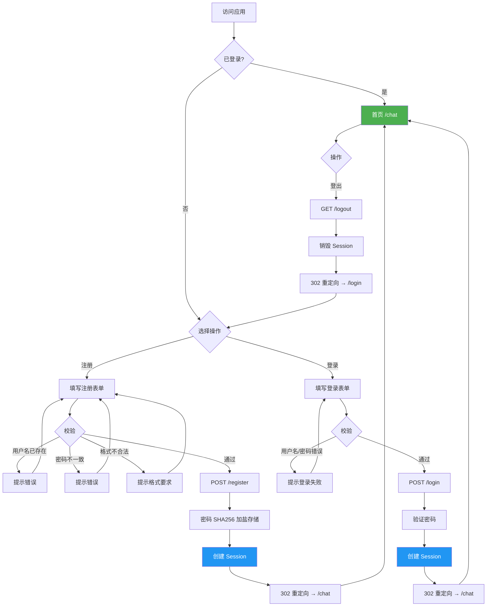
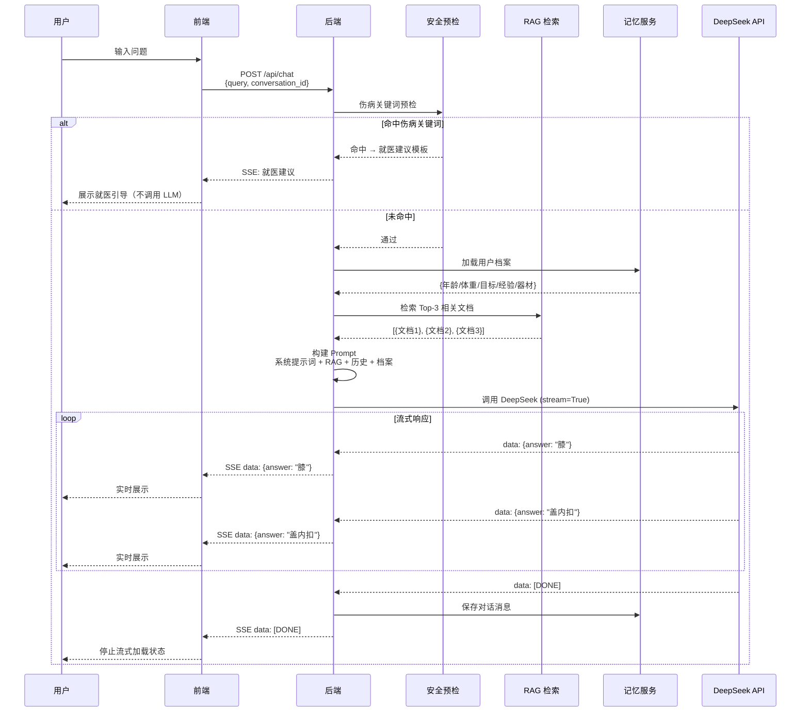
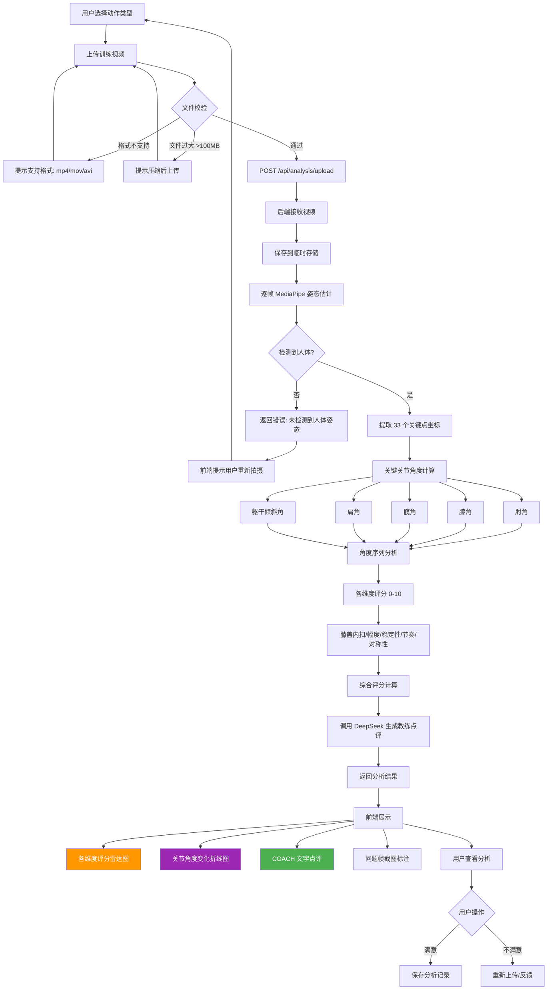
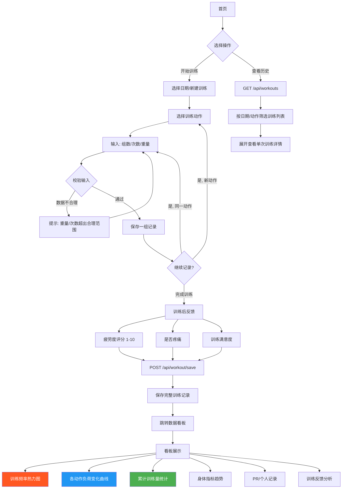
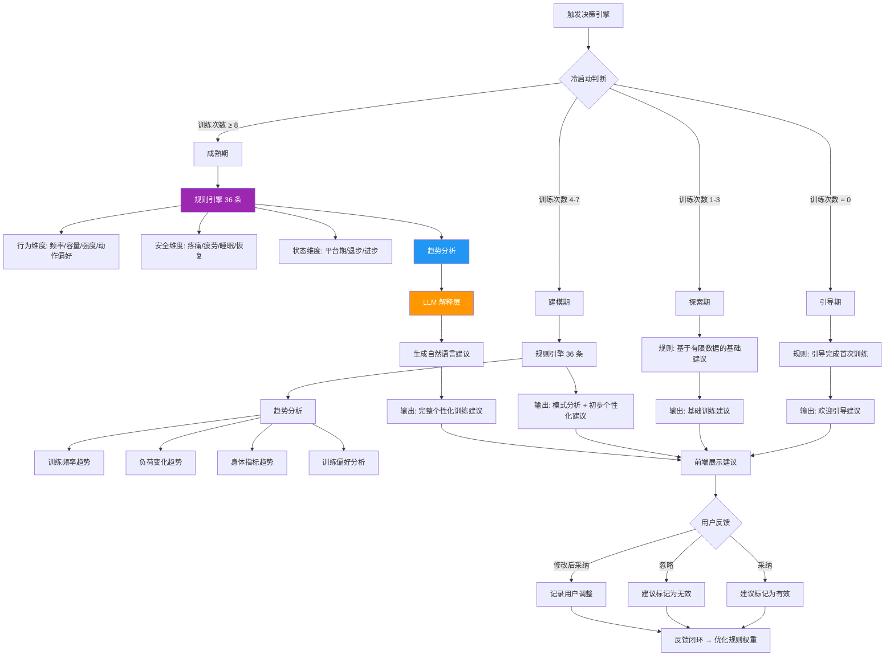

# 用户流程图

> 产品：AI健身教练 Web 应用
> 用户：王佳信（wjx），健身爱好者
> 用途：描述用户在产品中的完整行为路径、系统交互逻辑及边界场景处理

---

## 1. 整体用户旅程

用户从"想练但没人指导"的痛点出发，经历**注册 → 探索核心功能 → 持续使用积累数据 → 获得个性化指导**的完整闭环。

```
注册/登录 ──→ 首页（AI对话教练）
                    │
           ┌────────┼────────┐
           ▼        ▼        ▼
      AI提问    视频分析   训练记录
           │        │        │
           ▼        ▼        ▼
     即时回答   动作评分   训练数据
           │        │        │
           └────────┼────────┘
                    ▼
              数据看板
                    │
                    ▼
             决策引擎
                    │
                    ▼
            个性化训练建议
```

### 设计意图

| 阶段 | 用户痛点 | 产品应对 |
|------|---------|---------|
| 新手期 | 不知道从哪开始 | 引导式首页 + AI对话即时回答 |
| 探索期 | 动作做得对不对没人看 | 视频分析给出量化评分 |
| 积累期 | 练了但没记录，进步看不出来 | 训练记录 + 数据看板可视化 |
| 成熟期 | 训练不知道怎么调整 | 决策引擎基于数据出个性化建议 |

---

## 2. 注册 / 登录流程

> **用户痛点**：注册流程太长让人放弃，忘记密码找不到入口，登录后要重新操作。
>
> **设计意图**：注册后自动登录跳转首页，表单校验即时反馈，Session 过期自动跳转登录页。



### 边界场景

| 场景 | 处理方式 |
|------|---------|
| Session 过期 | 后端返回 401，前端自动跳转 /login |
| 未登录访问受保护页面 | 后端返回 302 到 /login |
| 密码暴力破解 | 限制 5 次失败后临时锁定 15 分钟 |
| 重复注册同一用户名 | 后端返回唯一约束错误，前端提示"用户名已被注册" |

---

## 3. AI 对话流程

> **用户痛点**：问健身问题怕 AI 瞎说，怕推荐的动作不安全，等回复太久就没耐心了。
>
> **设计意图**：安全预检优先于效率（伤病关键词先拦），RAG 确保回答有据可依，SSE 流式降低等待焦虑。



### 边界场景

| 场景 | 处理方式 |
|------|---------|
| **伤病检测命中** | 不调用 LLM，直接返回就医建议模板，前端高亮警示 |
| **DeepSeek API 超时** | 前端 10 秒无响应则显示"服务忙，请稍后重试" |
| **DeepSeek API 返回错误** | 降级：返回缓存中的相似问题回答，或引导重试 |
| **RAG 检索为空** | 跳过 RAG 上下文，仅用系统提示词 + 对话历史 + 用户档案 |
| **对话历史过长** | Truncate 策略：保留最近 N 轮对话，超长则摘要压缩 |
| **网络中断** | 前端 SSE 检测断连，自动尝试重连 3 次 |

---

## 4. 动作视频分析流程

> **用户痛点**：自己练不知道动作标不标准，请人看又麻烦。想看到"哪里不对"的具体证据。
>
> **设计意图**：用 MediaPipe 姿态估计做量化分析，关节角度变化图让"对不对"一目了然，COACH 点评给出可执行的改进建议。



### 关键设计决策

| 决策 | 原因 |
|------|------|
| 用**肘角**替代 depth ratio | 实现与拍摄角度无关的评分，2D 视频即可 |
| MediaPipe 本地计算 | 不需要 GPU，用户数据不上传第三方 |
| 评分 + 图表 + 点评三件套 | 既要量化分（快速认知），也要图表（证据），更要点评（可执行） |

### 边界场景

| 场景 | 处理方式 |
|------|---------|
| **视频中未检测到人体** | 返回错误码，前端提示"未检测到人体姿态，请确保拍摄到全身" |
| **动作与所选类型不匹配** | 评分偏低，点评中提示"检测到的动作与所选类型不一致" |
| **视频分析超时 >30s** | 返回局部结果 + 提示"部分帧分析可能不完整" |
| **拍摄角度不佳** | 在点评中说明"侧面视角分析更准确"的建议 |
| **多人入镜** | 默认分析画面中最大的人体 |

---

## 5. 训练记录 → 数据看板流程

> **用户痛点**：练完就忘，上周卧推多重、做了几组全凭记忆。进步还是退步只能靠感觉。
>
> **设计意图**：记录足够快（<10秒），看板足够直观，让"进步看得见"激励持续训练。



### 边界场景

| 场景 | 处理方式 |
|------|---------|
| **无训练记录** | 看板展示引导卡片："记录你的第一次训练，开始解锁数据分析" |
| **单次训练数据异常** | 箱线图自动排除离群值，但保留原始数据供查看 |
| **误录入数据** | 支持编辑和删除单条记录 |
| **跨日训练** | 允许用户选择日期，支持补录历史训练 |
| **数据导出** | 支持 CSV/PDF 导出训练记录 |

---

## 6. 训练决策引擎流程

> **用户痛点**：练了一段时间但不知道接下来该怎么调整——加重量？换动作？加容量？
>
> **设计意图**：三层架构保障决策质量——规则引擎兜底（可靠），趋势分析发现规律（数据驱动），LLM 转化为自然语言建议（可读）。



### 36 条规则引擎维度

| 维度 | 规则内容 | 示例 |
|------|---------|------|
| **行为维度 (12条)** | 训练频率、容量变化、强度变化、动作多样性、组间歇、训练时长、休息日间隔、动作选择偏好、训练分化模式、渐进超负荷状态、RPE 趋势、最大力量变化 | "连续 3 次训练容量下降 → 建议减载周" |
| **安全维度 (12条)** | 疼痛报告、疲劳度超标、睡眠不足、恢复不足、伤病史警示、动作风险评分、过度训练指标、热身缺失、拉伸缺失、饮水不足、营养摄入不足、心率异常 | "报告疼痛 + 连续疲劳 >8 → 建议休息+就医" |
| **状态维度 (12条)** | 平台期检测、进步速度、退步趋势、目标达成率、训练一致性、切换动作合理性、动作熟练度、身体测量变化、体成分变化、训练满意度、动机水平、季节性调整 | "深蹲重量 2 周未进步 → 建议更换训练模式" |

### 边界场景

| 场景 | 处理方式 |
|------|---------|
| **冷启动 (0次训练)** | 引导用户完成首次训练，不输出分析性建议 |
| **数据稀疏** | 仅输出规则引擎结果，跳过趋势分析和 LLM 解释 |
| **多规则冲突** | 优先级：安全维度 > 状态维度 > 行为维度 |
| **LLM 调用失败** | 降级：仅输出规则引擎的结构化建议（不生成自然语言） |
| **用户持续忽略建议** | 调整建议生成策略，探索不同风格的建议表述 |

---

## 7. 边界场景综合说明

### 7.1 未登录状态

| 操作 | 处理 |
|------|------|
| 访问 /chat | 302 重定向到 /login |
| 访问 /api/* | 返回 401 + 前端跳转 /login |
| 访问 /login（已登录） | 重定向到 /chat |
| 访问 /register（已登录） | 重定向到 /chat |

### 7.2 API 超时与错误

| 场景 | 兜底策略 |
|------|---------|
| DeepSeek API 超时 | 前端 10s 超时检测，显示"服务忙，请稍后重试" |
| DeepSeek API 429 | 退避重试策略：等待 1s → 2s → 4s 后重试 |
| DeepSeek API 5xx | 降级返回模板回答："当前服务繁忙，请稍后再问" |
| 视频分析 > 30s | 返回已完成的帧分析结果 + 部分结果提示 |
| 数据库连接失败 | 返回 503，前端显示维护提示 |

### 7.3 伤病关键词检测

> 关键词列表（部分）：骨折、韧带断裂、关节脱位、急性疼痛、肿胀、无法活动、出血、头晕、胸痛、呼吸困难

| 检测方式 | 行为 |
|---------|------|
| 精确匹配关键词 | 直接返回就医建议，不调用 LLM |
| 用户追问伤病 | 重复就医引导，不建议任何训练动作 |
| 误命中（如"以前骨折过现在好了"） | 仍返回就医建议，但 RS 字段标记为非紧急，允许用户选择继续提问 |

### 7.4 视频分析失败场景

| 失败原因 | 用户提示 |
|---------|---------|
| 未检测到人体 | "未检测到人体姿态，请确保：① 拍摄到全身 ② 光线充足 ③ 正面或侧面 45° 角度" |
| 关键点置信度低 | "部分帧分析精度不足，建议：① 避免穿着宽松衣物 ② 避免逆光拍摄" |
| 格式不支持 | "仅支持 mp4/mov/avi 格式，你的文件格式为 {detected_format}" |
| 文件过大 | "文件超过 100MB，建议压缩后上传或录制更短的视频（15-30 秒即可）" |
| 动作不匹配 | "检测到的动作与所选类型 {selected} 不一致，看起来更像 {detected}，请确认动作类型" |

### 7.5 数据为空状态

| 页面 | 空状态展示 |
|------|-----------|
| 训练记录列表 | 引导卡片："还没有训练记录，开始你的第一次训练吧！" + 快速开始按钮 |
| 数据看板 | 引导卡片："记录 3 次训练后，这里会展示你的训练数据趋势" |
| 分析记录 | 引导卡片："上传你的第一个训练视频，看看动作标准度评分" |
| 对话历史 | 空列表提示："还没有对话记录，开始和 AI 教练聊聊吧" |

---

## 附录：流程图索引

| 编号 | 图名 | 类型 | 用途 |
|------|------|------|------|
| 图1 | 整体用户旅程 | 文字流程图 | 产品全局视图 |
| 图2 | 注册/登录流程 | flowchart | 用户进入路径 |
| 图3 | AI 对话流程 | sequenceDiagram | 核心交互时序 |
| 图4 | 动作视频分析流程 | flowchart | 视频处理管线 |
| 图5 | 训练记录→数据看板 | flowchart | 数据采集与展示 |
| 图6 | 决策引擎流程 | flowchart | 个性化建议生成 |

---

> 文档状态：✅ 已完成
> 最后更新：2026-06-28
> 对应版本：v1.0.0
